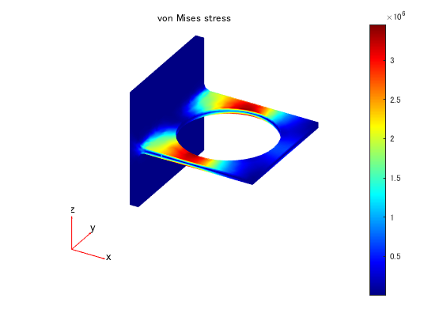

# PDE Toolbox 製品デモの日本語訳

This repo provides a Japanese translation of PDE Toolbox demos

Heat Conduction in Multidomain Geometry with Nonuniform Heat Flux |  Deflection Analysis of Bracket | Thermal Deflection of Bimetallic Beam
:-------------------------:|:-------------------------:|:-------------------------:
 | ||
-[Link to original](https://jp.mathworks.com/help/pde/ug/heat-conduction-in-multidomain-geometry-with-nonuniform-heat-flux.html)  - [View on browser](./demos/UnsteadyHeatConductionInAMultilayeredSphereExample_JP.md) | -[Link to original](https://www.mathworks.com/help/pde/ug/deflection-analysis-of-a-bracket.html)   -[View on browser](./demos/StrainedBracketExample_JP.md) | -[Link to original](https://jp.mathworks.com/help/pde/ug/thermal-deflection-of-bimetallic-beam.html)　  -[View on browser](./demos/ThermalDeflectionOfABimetallicStripExample_JP.md)

MATLAB and PDE Toolbox are required. The translations are of version R2019b unless otherwise noted.
