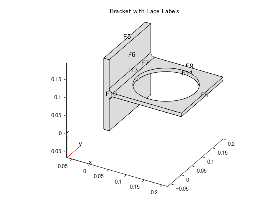
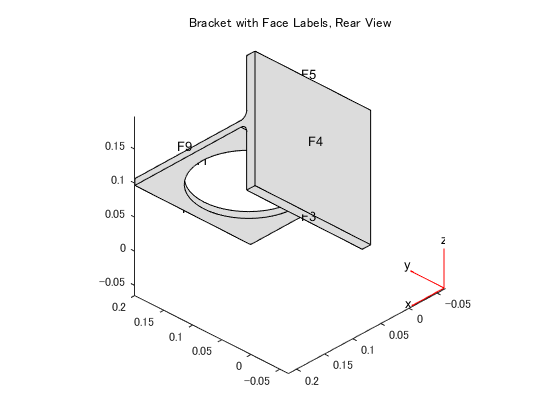
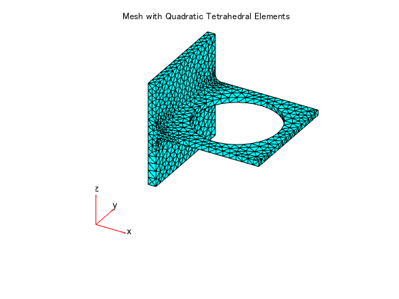
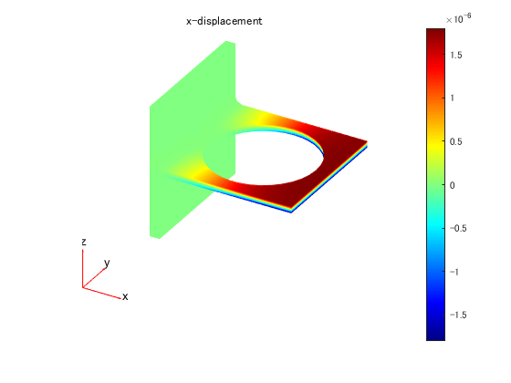
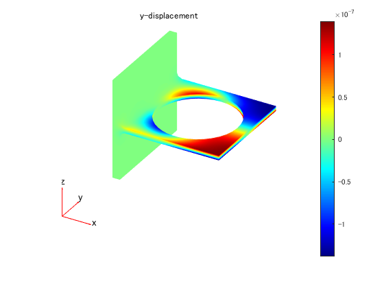
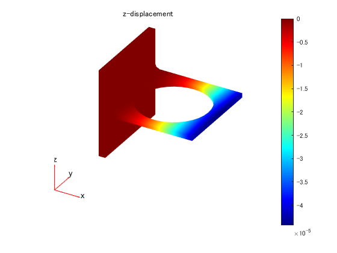

# ブラケットのたわみ解析


この例では、有限要素解析（FEA）を使用して、荷重がかかった3次元機械部品を解析し、最大たわみを求める方法を示します。


# 構造解析モデルの作成


線形弾性問題を解く最初のステップは、構造解析モデルを作成することです。


このモデルは、形状（ジオメトリ）、物性値（構造材料のプロパティ）、減衰パラメータ、物体力、荷重条件、拘束条件、有限要素の集合であるスーパーエレメントのインターフェース、初期変位と速度、メッシュが含まれるコンテナです。


```matlab
model = createpde('structural','static-solid');
```
# 形状（ジオメトリ）の読み込み


単純なブラケットモデルのSTLファイルを、 `importGeometry` を使って読み込みます。この関数により、モデルに含まれるフェース（面）、エッジ（辺）、ヴァーテックス（節点）が再構成されます。ただし、いくつかの面や辺は読み込み時にマージされる場合があるため、その数は、元となるCADモデルのそれとは異なる場合があります。


```matlab
importGeometry(model,'BracketWithHole.stl');
```


面番号を表示しながらジオメトリを描画します。


```matlab
figure
pdegplot(model,'FaceLabels','on')
view(30,30);
title('Bracket with Face Labels')
```



```matlab
figure
pdegplot(model,'FaceLabels','on')
view(-134,-32)
title('Bracket with Face Labels, Rear View')
```



# 物性値の指定


材料のヤング率とポアソン比を指定します。


```matlab
structuralProperties(model,'YoungsModulus',200e9, ...
                           'PoissonsRatio',0.3);
```
# 拘束条件や荷重条件といった境界条件の設定


この問題では、２つの境界条件を設定します。裏面（面４）を完全拘束し、表面に荷重を設定します。その他はデフォルト設定、つまり、何もしません。


```matlab
structuralBC(model,'Face',4,'Constraint','fixed');
```


表面である面８に、等分布荷重をーZ方向に設定します。


```matlab
structuralBoundaryLoad (model,'Face',8,'SurfaceTraction',[0;0;-1e4]);
```
# メッシュの生成


メッシュを生成し、描画します。


```matlab
generateMesh(model);
figure
pdeplot3D(model)
title('Mesh with Quadratic Tetrahedral Elements');
```



# 求解


`solve` を使って解を求めます。


```matlab
result = solve(model)
```
```
result = 
  StaticStructuralResults のプロパティ:

      Displacement: [1x1 FEStruct]
            Strain: [1x1 FEStruct]
            Stress: [1x1 FEStruct]
    VonMisesStress: [5993x1 double]
              Mesh: [1x1 FEMesh]

```
# たわみの計算


Z方向での最大たわみを計算します。


```matlab
minUz = min(result.Displacement.uz);
fprintf('Maximal deflection in the z-direction is %g meters.', minUz)
```
```
Maximal deflection in the z-direction is -4.43075e-05 meters.
```
# 変位量の描画


得られた解に含まれるコンポネントを描画します。Z方向のたわみが最も大きくなります。これは、構造解析対象である部品と荷重条件が対称であるためX方向の変位とZ方向の変位が対称になり、Y方向の変位は中心線に対して非対称になります。


ここで、JETカラーマップを使って描画します。このカラーマップにおいて青は最低値になり、赤が最大値になります。面８に荷重がかかってるため、Z方向の変位は、この面が最小値（絶対値としては最大）になります。


```matlab
figure
pdeplot3D(model,'ColorMapData',result.Displacement.ux)
title('x-displacement')
colormap('jet')
```



```matlab

figure
pdeplot3D(model,'ColorMapData',result.Displacement.uy)
title('y-displacement')
colormap('jet')
```



```matlab

figure
pdeplot3D(model,'ColorMapData',result.Displacement.uz)
title('z-displacement')
colormap('jet')
```



# フォン・ミーゼス応力の描画


フォン・ミーゼス応力を節点位置に描画します。JETカラーマップを使用します。


```matlab
figure
pdeplot3D(model,'ColorMapData',result.VonMisesStress)
title('von Mises stress')
colormap('jet')
```


*Copyright 2014-2020 The MathWorks, Inc.*


*Japanese edition is developped by Dr. Hiroyuki HISHIDA *


