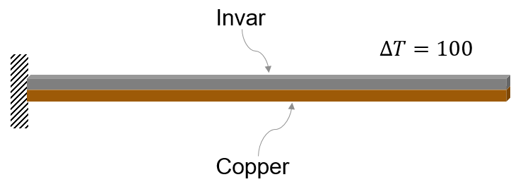
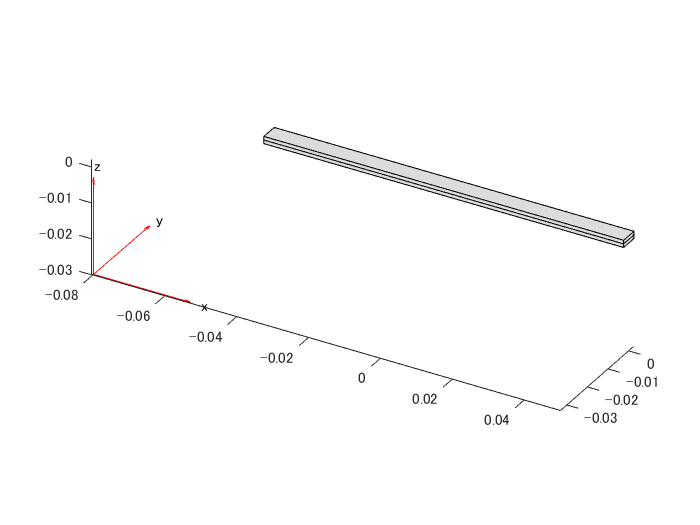
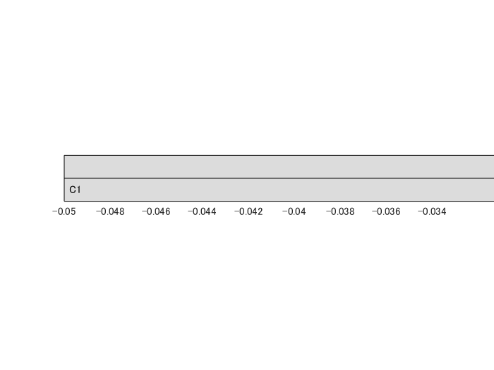
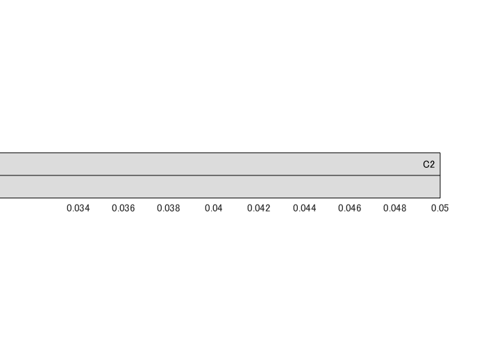
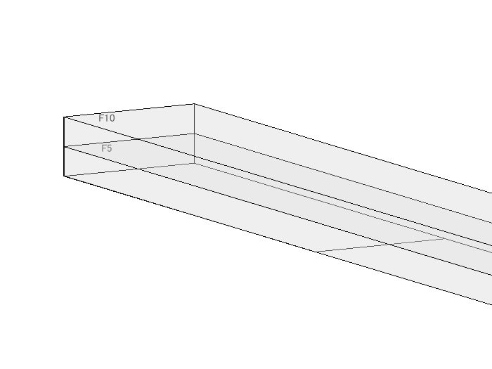

# Thermal Deflection of Bimetallic Beam


この例では、熱弾性問題を解く方法を紹介します。機械構造の熱膨張または収縮は、動作環境の温度変化により発生します。熱応力は二次的な現象です：構造上の制約によりコンポーネントの自由な熱膨張または収縮が妨げられると、構造に応力がかかります。よくある物理実験としてバイメタルビームのたわみを取り上げます。典型的なバイメタルビームは、互いに結合された2つの材料で構成されています。これらの材料の熱膨張係数（CTE：coefficients of thermal expansion）は大きく異なります。





この例では、構造有限要素モデルを使用してバイメタルビームのたわみを計算し、ビーム理論近似に基づいた解析解と比較しています。 


静的構造モデルを作成します。


```matlab
structuralmodel = createpde('structural','static-solid');
```


次の寸法のビーム形状を作成します。


```matlab
L = 0.1; % m
W = 5E-3; % m
H = 1E-3; % m
gm = multicuboid(L,W,[H,H],'Zoffset',[0,H]);
```


構造モデルに形状の情報を追加します。


```matlab
structuralmodel.Geometry = gm;
```


形状をプロットします。


```matlab
figure
pdegplot(structuralmodel)
```




材料特性を指定するセルのラベルを特定します。


まず一番下のセルのラベルを表示します。ラベルを明確に表示するには、ビームの左端をズームし、次のように形状を回転させます。


```matlab
figure
pdegplot(structuralmodel,'CellLabels','on')
axis([-L/2 -L/3 -W/2 W/2 0 2*H])
view([0 0])
zticks([])
```




次に、上のセルラベルを表示します。セルラベルを明確に表示するには、ビームの右端をズームし、次のように形状を回転します。


```matlab
figure
pdegplot(structuralmodel,'CellLabels','on')
axis([L/3 L/2 -W/2 W/2 0 2*H])
view([0 0])
zticks([])
```




ヤング率、ポアソン比、および線形熱膨張係数を指定して、線形弾性材料の挙動をモデル化します。単位系の一貫性を維持するには、すべての物理プロパティを SI ユニットで指定します。 


銅の材料特性を下部セルに割り当てます。


```matlab
Ec = 137E9; % N/m^2
nuc = 0.28;
CTEc = 20.00E-6; % m/m-C
structuralProperties(structuralmodel,'Cell',1, ...
                                     'YoungsModulus',Ec, ...
                                     'PoissonsRatio',nuc, ...
                                     'CTE',CTEc);
```


インバー（不変鋼）の材料特性を上部セルに割り当てます。


```matlab
Ei = 130E9; % N/m^2
nui = 0.354;
CTEi = 1.2E-6; % m/m-C
structuralProperties(structuralmodel,'Cell',2, ...
                                     'YoungsModulus',Ei, ...
                                     'PoissonsRatio',nui, ...
                                     'CTE',CTEi);
```


この例では、ビームの左端が固定されていると仮定します。この境界条件を課すためは、まずビームの左端に面ラベルを表示します。


```matlab
figure
pdegplot(structuralmodel,'faceLabels','on','FaceAlpha',0.25)
axis([-L/2 -L/3 -W/2 W/2 0 2*H])
view([60 10])
xticks([])
yticks([])
zticks([])
```




面 5 と 10 に固定端という条件を与えます。


```matlab
structuralBC(structuralmodel,'Face',[5,10],'Constraint','fixed');
```


温度変化を熱負荷として適用します。摂氏25度の基準温度と摂氏125度の動作温度を想定します。したがって、このモデルの温度差は摂氏100度です。


```matlab
structuralBodyLoad(structuralmodel,'Temperature',125);
structuralmodel.ReferenceTemperature = 25;
```


メッシュを生成し解を求めます。


```matlab
generateMesh(structuralmodel,'Hmax',H/2);
R = solve(structuralmodel);
```


変位の大きさをカラーマップデータとしてバイメタルビームの変形後の形状をプロットします。


```matlab
figure
pdeplot3D(structuralmodel,'ColorMapData',R.Displacement.Magnitude, ...
                          'Deformation',R.Displacement, ...
                          'DeformationScaleFactor',2)
title('Deflection of Invar-Copper Beam')
```


ビーム理論に基づいてたわみを解析的に計算します。たわみは , ここで ,  は温度差,  と  は銅とインバーの熱膨張係数,  と  は銅とインバーのヤング率,  はビームの長さです。


```matlab
K1 = 14 + (Ec/Ei)+ (Ei/Ec);
deflectionAnalytical = 3*(CTEc - CTEi)*100*2*H*L^2/(H^2*K1);
```


解析解と数値計算で得られた値を比較します。


```matlab
PDEToobox_Deflection = max(R.Displacement.uz);
percentError = 100*(PDEToobox_Deflection - ...
                    deflectionAnalytical)/PDEToobox_Deflection;

bimetallicResults = table(PDEToobox_Deflection, ...
                          deflectionAnalytical,percentError);
bimetallicResults.Properties.VariableNames = {'PDEToolbox', ...
                                              'Analytical', ...
                                              'PercentageError'};
disp(bimetallicResults)
```
```
    PDEToolbox    Analytical    PercentageError
    __________    __________    _______________

    0.0071061     0.0070488         0.80608    
```


*Copyright 2018 The MathWorks, Inc.*


