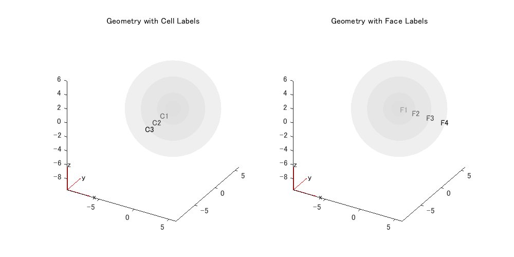
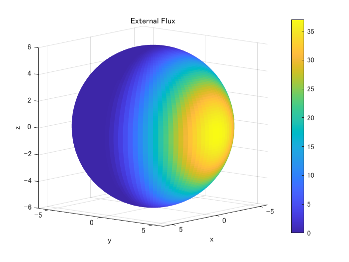
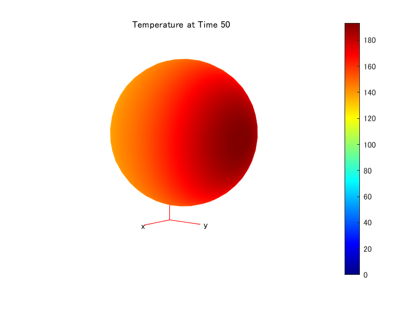
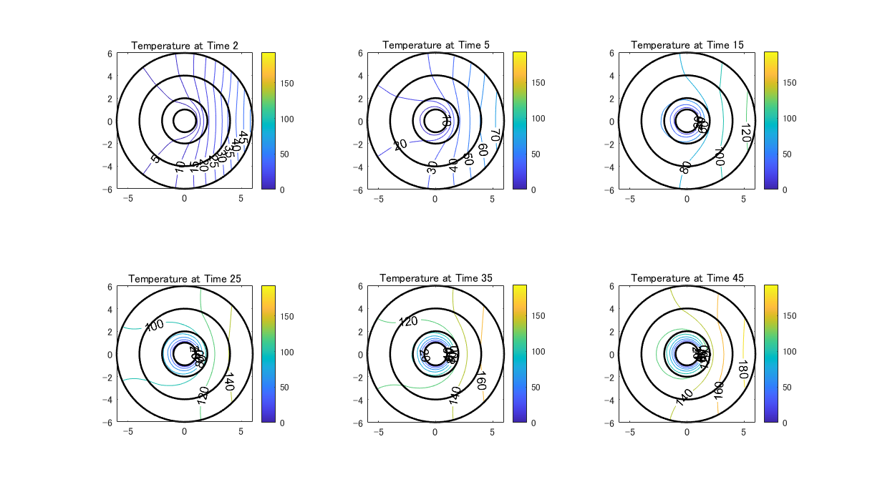

# Heat Conduction in Multidomain Geometry with Nonuniform Heat Flux


この例では、3つの異なる材料層でできた中空球の3次元過渡熱伝導解析を実行する方法を示します。 


球体は不均一な外部熱流束の影響を受けます。


この問題の物理的特性と形状は、Singh, Suneet, P. K. Jain, and Rizwan-uddin（参考文献を参照）で説明されており、この問題の解析解もあります。球の内面の温度は常にゼロです。外側半球（y が正値）には、次の式で定義される不均一な熱流束があります。


 と  は球内の方位角と仰角です。最初は、球体のすべての点の温度はゼロとします。


# モデル定義


過渡熱解析用の熱モデルを作成します。


```matlab
thermalmodel = createpde('thermal','transient');
```


`multisphere` 関数を使用して多層球を作成します。できた形状を上で作った熱モデルに割り当てます。球体には、中空の内部コアを持つ3つの材料層があります。


```matlab
gm = multisphere([1,2,4,6],'Void',[true,false,false,false]);
thermalmodel.Geometry = gm;
```


形状をプロットし、セルと面のラベルを表示します。 `FaceAlpha` を 0.25 に設定して、内部のラベルが表示されるようにします。


```matlab
figure('Position',[10,10,800,400]);
subplot(1,2,1)
pdegplot(thermalmodel,'FaceAlpha',0.25,'CellLabel','on')
title('Geometry with Cell Labels')
subplot(1,2,2)
pdegplot(thermalmodel,'FaceAlpha',0.25,'FaceLabel','on')
title('Geometry with Face Labels')
```



# メッシュ作成


メッシュを生成します。ここでは処理速度を高速化するために粗い（形状を正確に表すのに十分に細かい）メッシュサイズにします。


```matlab
generateMesh(thermalmodel,'Hmax',1);
```


球体の各層の熱伝導率、質量密度、および比熱を指定します。ここでは材料特性は無次元の値であり、実際の材料特性値ではない点に注意してください。


```matlab
thermalProperties(thermalmodel,'Cell',1,'ThermalConductivity',1, ...
                                        'MassDensity',1, ...
                                        'SpecificHeat',1);
thermalProperties(thermalmodel,'Cell',2,'ThermalConductivity',2, ...
                                        'MassDensity',1, ...
                                        'SpecificHeat',0.5);
thermalProperties(thermalmodel,'Cell',3,'ThermalConductivity',4, ...
                                        'MassDensity',1, ...
                                        'SpecificHeat',4/9);
```
# 境界条件定義


境界条件を指定します。最も内側の面の温度は常にゼロです。


```matlab
thermalBC(thermalmodel,'Face',1,'Temperature',0);
```


球の外面には外部熱流束があります。熱流束を定義するために、熱的境界条件を与える関数を使用します。


```matlab
function Qflux = externalHeatFlux(region,~)
    [phi,theta,~] = cart2sph(region.x,region.y,region.z);
    theta = pi/2 - theta; % transform to 0 <= theta <= pi
    ids = phi > 0;
    Qflux = zeros(size(region.x));
    Qflux(ids) = theta(ids).^2.*(pi - theta(ids)).^2.*phi(ids).^2.*(pi - phi(ids)).^2;
end
```


表面の熱流束をプロットします。


```matlab
[phi,theta,r] = meshgrid(linspace(0,2*pi),linspace(-pi/2,pi/2),6);
[x,y,z] = sph2cart(phi,theta,r);
region.x = x;
region.y = y;
region.z = z;
flux = externalHeatFlux(region,[]);
figure
surf(x,y,z,flux,'LineStyle','none')
axis equal
view(130,10)
colorbar
xlabel 'x'
ylabel 'y'
zlabel 'z'
title('External Flux')
```




この境界条件をモデルに追加します。


```matlab
thermalBC(thermalmodel,'Face',4,'HeatFlux',@externalHeatFlux,'Vectorized','on');
```
# 初期条件


初期条件：すべての点で初期温度がゼロになるように定義します。


```matlab
thermalIC(thermalmodel,0);
```
# 求解


熱分布の過渡的変化を追うため、時間ステップベクトルを定義し解を求めます。


```matlab
tlist = [0,2,5:5:50];
R = solve(thermalmodel,tlist);
```


等高線のレベルをすべてのプロットで同じにするために、求められた解の中での温度範囲を求めます。最小温度は球の内面の境界条件であるゼロです。


```matlab
Tmin = 0;
```


最終タイムステップの解から最高温度を見つけます。


```matlab
Tmax = max(R.Temperature(:,end));
```
# 可視化


`tlist` で定義された時刻において `Tmin` から `Tmax` の範囲で等高線をプロットします。


```matlab
h = figure;
for i = 1:numel(tlist)
    pdeplot3D(thermalmodel,'ColorMapData',R.Temperature(:,i))
    caxis([Tmin,Tmax])
    view(130,10)
    title(['Temperature at Time ' num2str(tlist(i))]);
    M(i) = getframe;
end
```




動画を表示するには以下のコマンドを実行してください。（2 回再生します）


```matlab
movie(M,2)
```


断面温度の等高線図を描きます。まず、 における  平面の長方形グリッドを定義します。


```matlab
[YG,ZG] = meshgrid(linspace(-6,6,100),linspace(-6,6,100));
XG = zeros(size(YG));
```


グリッド上での温度を内挿して求めます。断面温度の等高線図の変化を観察するために、いくつかの時刻における温度分布を内挿して求めます。


```matlab
tIndex = [2,3,5,7,9,11];
varNames = {'Time_index','Time_step'};
index_step = table(tIndex.',tlist(tIndex).','VariableNames',varNames);
disp(index_step);
```
```
    Time_index    Time_step
    __________    _________

         2            2    
         3            5    
         5           15    
         7           25    
         9           35    
        11           45    
```
```matlab
TG = interpolateTemperature(R,XG,YG,ZG,tIndex);
```


断面に各層の境界を表す円を表示するための準備：


```matlab
t = linspace(0,2*pi);
ylayer1 = cos(t); zlayer1 = sin(t);
ylayer2 = 2*cos(t); zlayer2 = 2*sin(t);
ylayer3 = 4*cos(t); zlayer3 = 4*sin(t);
ylayer4 = 6*cos(t); zlayer4 = 6*sin(t);
```


時間インデックス `tIndex` に対応する時刻における温度の等高線を、 `Tmin` から `Tmax` の範囲でプロットします。


```matlab
figure('Position',[10,10,1000,550]);
for i = 1:numel(tIndex)
    subplot(2,3,i)
    contour(YG,ZG,reshape(TG(:,i),size(YG)),'ShowText','on')
    colorbar
    title(['Temperature at Time ' num2str(tlist(tIndex(i)))]);
    hold on
    caxis([Tmin,Tmax])
    axis equal
    % Plot boundaries of spherical layers for reference.
    plot(ylayer1,zlayer1,'k','LineWidth',1.5)
    plot(ylayer2,zlayer2,'k','LineWidth',1.5)
    plot(ylayer3,zlayer3,'k','LineWidth',1.5)
    plot(ylayer4,zlayer4,'k','LineWidth',1.5)
end
```



# Helpter function
```matlab
function Qflux = externalHeatFlux(region,~)
    [phi,theta,~] = cart2sph(region.x,region.y,region.z);
    theta = pi/2 - theta; % transform to 0 <= theta <= pi
    ids = phi > 0;
    Qflux = zeros(size(region.x));
    Qflux(ids) = theta(ids).^2.*(pi - theta(ids)).^2.*phi(ids).^2.*(pi - phi(ids)).^2;
end
```
# Reference


[1] Singh, Suneet, P. K. Jain, and Rizwan-uddin. "Analytical Solution for Three-Dimensional, Unsteady Heat Conduction in a Multilayer Sphere." ASME. J. Heat Transfer. 138(10), 2016, pp. 101301-101301-11. 


*Copyright 2015-2018 The MathWorks, Inc.*


